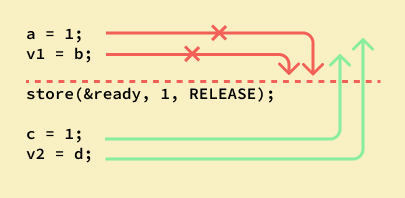

import "../styles/memory-ordering.css"

### CPU Shenanigans with Memory Operations

Every CPU executes programs that generate memory access operations. These operations can be performed by the CPU in any order it prefers, as long as the program's causality is preserved. Similarly, a compiler may rearrange the instructions it emits, provided this reordering doesn't affect the program's apparent operation. Here is an example of what I mean.

```cpp
void setValue()
{
   foo->data = 10;
   foo->ready = true;
}

void checkValue()
{
   ready = foo->ready;
   if (ready) assert(foo->data == 10);
}

int main() {
    std::thread setter(setValue);
    std::thread checker(checkValue);

    setter.join();
    checker.join();

    return 0;
}
```

The thread `setter` sets the `data` and then sets the `ready` flag. Thread `checker` reads the `data` if the `ready` flag is set. One might assume that the program is correct and the `assert` always succeeds. However, the what if I told you that the assert can fail. That is because the compiler is free to reorder the instructions it emits. The compiler might choose to emit the instructions in the following order:

The setter might emit something like this

```sh
STORE ready = true
STORE data = 10
```

Or the checker might emit something like this

```sh
LOAD data
LOAD ready
```

But why would the compiler do that ? Well for performance that we programmers take for granted everyday. Infact behind the screens the compilers do a lot of things to make our programs run faster. including reordering, deferral and combination of memory operations; speculative loads; speculative branch prediction and various types of caching.

So how bad is it ? Consider this simple program

```
CPU 1		        CPU 2
===============	===============
{ A == 1; B == 2 }
A = 3;		      x = B;
B = 4;		      y = A;
```

It start of with `A -> 1` and `B -> 2`. But from what we've just learned, the compiler is free to reorder the instructions it emits. So the set of memory accesses can be arranged in 24 different combinations.

```sh
STORE A=3,	STORE B=4,	y=LOAD A->3,	x=LOAD B->4
STORE A=3,	STORE B=4,	x=LOAD B->4,	y=LOAD A->3
STORE A=3,	y=LOAD A->3,	STORE B=4,	x=LOAD B->4
STORE A=3,	y=LOAD A->3,	x=LOAD B->2,	STORE B=4
STORE A=3,	x=LOAD B->2,	STORE B=4,	y=LOAD A->3
STORE A=3,	x=LOAD B->2,	y=LOAD A->3,	STORE B=4
STORE B=4,	STORE A=3,	y=LOAD A->3,	x=LOAD B->4
STORE B=4, ...
```

and can thus result in four different combinations of values:

```sh
x == 2, y == 1
x == 2, y == 3
x == 4, y == 1
x == 4, y == 3
```

Yikes..., So can everything be reordered ? Well the CPU does provide us with some minimal guarantees. On any cpu dependent memory accesses will be issued in order, with respect to itself.

```sh
Q = READ_ONCE(P); D = READ_ONCE(*Q);
```

the CPU will always issue the following memory operations:

```sh
Q = LOAD P, D = LOAD *Q
```

Also Overlapping loads and stores are not reordered with respect to each other.

```sh
a = READ_ONCE(*X); WRITE_ONCE(*X, b);
```

the CPU will only issue the following sequence of memory operations:

```sh
a = LOAD *X, STORE *X = b
```

But what if we really wanted to get our program working as intended. Thats where memory barriers come in. Memory barriers are used to override or suppress these tricks, allowing the code to sanely control the interaction of multiple CPUs and/or devices. They help control the relative ordering of memory accesses. There are different kinds of memory barriers offered to us programmers.

**Write barriers** control the order of writes. Because writes to memory are slow (compared to the speed of the CPU), there is usually a write-request queue where writes are posted before they 'really happen'. Although they are queued in order, while inside the queue the writes may be reordered. (So maybe 'queue' isn't the best name...) Unless you use write barriers to prevent the reordering.

**Read barriers** control the order of reads. Because of speculative execution (CPU looks ahead and loads from memory early) and because of the existence of the write buffer (the CPU will read a value from the write buffer instead of memory if it is there - ie the CPU thinks it just wrote X = 5, then why read it back, just see that it is still waiting to become 5 in the write buffer) reads may happen out of order.

So read/write barriers put up blocks to prevent reordering in the read/write queues (the read isn't usually so much of a queue, but the reordering effects are the same).

What kinds of blocks? - acquire and/or release blocks.

**Acquire** - eg read-acquire(x) will add the read of x into the read-queue and flush the queue (not really flush the queue, but add a marker saying don't reorder anything before this read, which is as if the queue was flushed). So later (in code order) reads can be reordered, but not before the read of x.

**Release** - eg write-release(x, 5) will flush (or marker) the queue first, then add the write-request to the write-queue. So earlier writes won't become reordered to happen after x = 5, but note that later writes can be reordered before x = 5.

Note that I paired the read with acquire and write with release because this is typical, but different combinations are possible.

Acquire and Release are considered 'half-barriers' or 'half-fences' because they only stop the reordering from going one way.

A full barrier (or full fence) applies both an acquire and a release - ie no reordering.

Rust offers use 5 different kinds of memory orderings

```rust
#[non_exhaustive]
pub enum Ordering {
    Relaxed,
    Release,
    Acquire,
    AcqRel,
    SeqCst,
}
```

A `Relaxed` ordering would ofcourse mean that the compiler/cpu is free to reorder instruction any way it wants to. On the other end we have `SeqCst` ordering which is a full barrier. 'Sequentially Consistent' ordering prevents any reodering of memory instructions.

Here are some diagrams that lets you visualize what each Ordering offers you as a guarantee.

<ul className="orderings">
  <li>
    
    <p> Relaxed </p>
  </li>
  <li>
    
    <p> Acquire </p>
  </li>
  <li>
    
    <p> Release </p>
  </li>
  <li>
    
    <p> SeqCst </p>
  </li>
</ul>

### Pairing Memory Barriers: It's All About Teamwork

When dealing with CPU-CPU interactions, certain types of memory barrier should
always be paired. A lack of appropriate pairing is almost certainly an error.

Consider in our initial example we added an `Release` barrier to the `setValue` function.
We could guarantee that the `ready` flag is set before the `data` is set.

```sh
STORE data = 10
<release_barrier>
STORE ready = true
```

But without a corresponding `Release` barrier the `checkValue` function might still emit the following instructions which reads them out of place, and the `assert` might fail.

```sh
LOAD data
LOAD ready
```

An acquire barrier pairs with a release barrier, but both may also pair with
other barriers, including of course a general(`SeqCst`) barrier . A write
barrier pairs with an an acquire barrier, a release barrier, a read barrier, or
a general barrier. Similarly a read barrier, control dependency, or an
address-dependency barrier pairs with a write barrier, an acquire barrier, a
release barrier, or a general barrier.

Given what we've learned we can now fix our initial program.

```cpp
void setValue()
{
   foo->data = 10;
   write_release(foo->ready, true); // release barrrier here
}
void checkValue()
{
   ready = read_acquire(foo->ready); // acquire barrier here.
   if (ready) assert(foo->data == 10);
}
```

This will make sure the `data` is set before the `ready` flag is set and also that when the `ready` flag is read in `checkValue` then if is true the `data` has indeed been set as 10.

So, there you have it! Memory barriers are like the superheroes of the programming world, keeping things orderly and predictable, especially when CPUs and compilers try to be too smart for their own good. Understanding and using them correctly can save your multithreaded programs from a lot of headaches!
